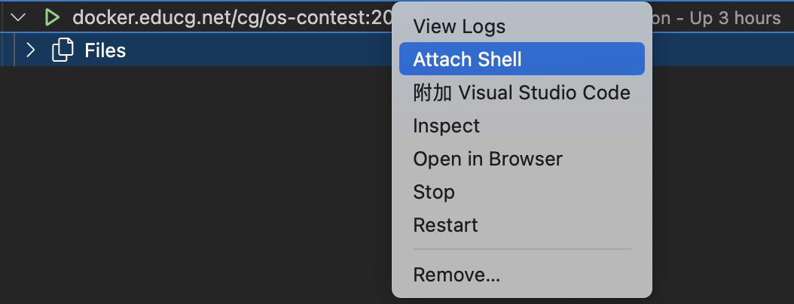
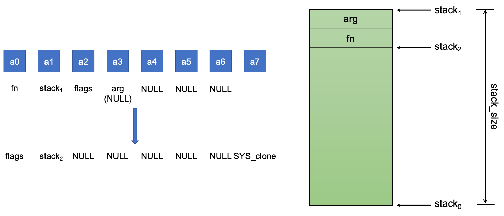
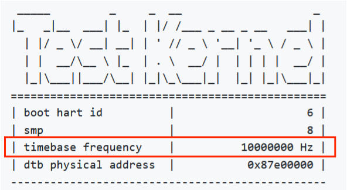

# 操作系统内核大赛：基于xv6-k210的系统调用实现  

刘沛雨 2100012289

---

## 目录


一、概述  

二、xv6-k210简介  
  
1.  依赖  
  
2.  文件系统  
  
3.  内存管理  
  
4.  进程管理  

三、准备工作：系统的启动、样例读取与关机  

1.  启动  
      
2.  将测试用例加入xv6-k210的用户程序  
      
3.  测试用例的自动读取  
     
4.  自动关机  

四、系统调用的实现  
    
0.  添加系统调用的过程  

1.  文件系统相关的系统调用  
    
2.  进程管理相关的系统调用
   
3.  内存管理相关的系统调用
   
4.  其他系统调用
    
五、尚未解决的问题  
  
1.  未实现的系统调用
  
2.  各种flag以及option的实现
  
3.  本地多核启动部分情况下死机

六、总结  
  
1.  成果与收获
  
2.  未来的改进方向
  
3.  个人感想


## 一、概述
本实验由**单人**完成，在xv6-k210 (https://github.com/HUST-OS/xv6-k210) 的基础上对内核向用户提供的系统调用接口进行扩展，使之满足大赛要求。大多数系统调用在xv6-k210中已经有类似的实现，但功能和大赛要求不完全一致；此外大赛要求系统在启动后能够自动读取测试样例进行测试，测试完成后自动关机。因此需要在xv6-k210的基础上进行适当地修改，使系统满足大赛要求。  

我们的操作系统根据比赛要求成功实现了**绝大多数**系统调用，达到了课程要求的测试分数。但在实验过程中，也遇到了一些目前尚未解决的问题。以下将介绍实验的大致流程与具体系统调用的实现过程（将详细介绍**getcwd**和**clone**两个系统调用），以及实验过程中遇到的问题。
## 二、xv6-k210简介
这里我们只简单介绍xv6-k210中对实验相对重要的部分（参考了xv6-k210文档的部分内容）。有关xv6-k210的详细介绍参见https://github.com/HUST-OS/xv6-k210 。  
### 1.  依赖
---
+ `k210` 开发板或者 `qemu-system-riscv64`  
+ RISC-V GCC 编译链: [riscv-gnu-toolchain](https://github.com/riscv/riscv-gnu-toolchain.git)    

本实验使用`qemu-system-riscv64`和RISC-V GCC 编译链来编译和运行操作系统。  
### 2.  文件系统
---
xv6-k210将xv6的类Unix系统修改为类似**FAT32**的文件系统，从而可以方便地挂载SD卡（大多数SD卡均为FAT32格式）。具体修改如下：
+ FAT32不支持日志系统，去掉了xv6文件系统的log层（log.c）；
+ FAT32没有inode，文件的元数据直接存放在目录项中，因此去掉了`struct inode`，替换为目录项`struct dirent`（directory entry）；
+ FAT32没有link，因此删除了相关的系统调用；
+ 重新实现xv6文件系统（fs.c）中的各个函数，将函数接口中的inode替换成了entry，函数命名上保留原函数的特征但也做了修改以示区分，如`ilock`变为`elock`、`writei`变为`ewrite`等等；
+ 关于buf层，由于FAT32的一个簇的大小较大，并且依不同的存储设备而变，因此目前以扇区为单位作缓存。

xv6-k210文件系统的实现为我们的实验带来了一点麻烦，具体问题将在之后讨论。
### 3.  内存管理
---
xv6为每个进程维护一个页表，用于描述每个进程的用户地址空间。除此之外，还有单独一个页表用于描述内核的地址空间。内核配置其地址空间的布局，以使其能够以可预测的虚拟地址访问物理内存和各种硬件资源。文件[(kernel/memlayout.h)](https://github.com/mit-pdos/xv6-riscv/blob/riscv//kernel/memlayout.h)声明了xv6内核内存布局的常量。xv6-k210内存管理基本与xv6保持一致。
### 4.  进程管理
---
xv6的进程管理相对简单，不支持单一进程下的多线程（没有线程的概念），xv6-k210沿袭了这一点。几个核心原理如下：
+  `userinit`(/xv6-k210/kernel/main.c: 58)中初始化第一个用户进程
+  进程调度器`scheduler`(/xv6-k210/kernel/proc.c: 564)进行进程调度
+  内核周期性（时钟中断）调用`yield`函数(/xv6-k210/kernel/proc.c: 634)，进行一系列操作完成进程切换

为了让系统在启动后自动读取样例并在测试完成后自动关机，需要对`init`(/xv6-k210/xv6-user/init.c)做一些修改，之后将具体讨论。
## 三、准备工作：系统的启动、样例读取与关机
### 1.  启动
---
系统在大赛提供的docker镜像中运行，xv6-k210在docker镜像中的启动流程如下：
#### 拉取大赛提供的镜像  
```bash 
docker pull docker.educg.net/cg/os-contest:2024p6
```
#### 创建容器并启动
```bash
docker run -it --restart=always --privileged=true docker.educg.net/cg/os-contest:2024p6
```
+  `--restart=always` ：使容器在docker运行时自动启动    
+  `--privileged=true`：赋予容器所有的主机权限，允许容器内部执行特定的特权操作，例如访问设备文件等。  
#### 在vscode中打开容器
实验需要修改容器中的文件，后续我们使用vscode的Docker扩展（下图）进行实验。  

上一步容器启动后，我们可以在vscode中找到该容器，并查看其中的文件，也可以使用shell，如下图所示。  

效果等同于：
```bash
docker exec -it <your container name> /bin/bash
```
#### 获取xv6-k210
```bash
git clone https://github.com/HUST-OS/xv6-k210.git
```

####  更改/xv6-k210/Makefile 中的fs，删去其中的所有"sudo"
因为进入镜像后默认就是root，sudo不再生效。
```makefile
@sudo cp README $(dst)/README -> @cp README $(dst)/README
```
#### 更改/xv6-k210/Makefile第132行为-m 32M
参见[Some ROM regions are overlapping · Issue #41 · HUST-OS/xv6-k210 (github.com)](https://github.com/HUST-OS/xv6-k210/issues/41)
```makefile
QEMUOPTS = -machine virt -kernel $T/kernel -m 128M -nographic
```
#### 更改rustsbi版本
下载https://github.com/rustsbi/rustsbi-qemu/releases/download/v0.2.0-alpha.2/rustsbi-qemu-release.zip ，将bootloader/SBI/sbi-qemu更换为压缩包中的sbi-qemu（参见 [rustsbi qemu panic due to invalid instruction · Issue #12 · rustsbi/rustsbi (github.com)](https://github.com/rustsbi/rustsbi/issues/12)）。
#### 启动xv6-k210
```bash
make fs
make run platform=qemu
```
在/xv6-k210/Makefile中可以修改系统默认的平台和模式，在实验过程中我们将平台设置为qemu，模式设置为debug以便于调试。
```makefile
# platform := k210
platform := qemu
mode := debug
# mode := release
```
系统启动后进入shell，则说明启动成功（进入shell后用户无法通过键盘输入是正常的）。
### <font color=red>2.  将测试用例加入xv6-k210的用户程序</font>
---
#### 获取测试用例
首先将测试用例克隆到容器的根目录下：  
```bash
git clone https://github.com/oscomp/testsuits-for-oskernel.git
```
/testsuits-for-oskernel中给出了包含已编译好的测试用例的磁盘映像压缩包（sdcard.img.gz），解压后得到sdcard.img，将其移动或复制到/xv6-k210中。  
<font color=grey>注：在实验过程中首先尝试了以下方法：将测试用例源代码（/testsuits-for-oskernel/riscv-syscalls-testing/user/src）按照给定的方式（/testsuits-for-oskernel/riscv-syscalls-testing/README.md）编译得到可执行文件，再将可执行文件按照xv6-k210中给出的方式（/xv6-k210/README_cn.md）添加为用户程序。后续实验发现这种方法似乎不可行（忘了具体原因了TAT）。</font>  
#### 将sdcard.img和xv6-k210文件系统整合
在得到SD卡磁盘映像后，我们需要将其中的文件和/xv6-k210的文件整合起来组成文件系统，可以通过修改/xv6-k210/Makefile中生成磁盘映像的部分（`fs`）来实现。思路是将sdcard.img挂载到容器的指定文件夹下（如/mnt），再把xv6-k210中有关的文件复制到sdcard.img下。
```makefile
fs: $(UPROGS)
	@if [ ! -f "sdcard.img" ]; then \
		echo "making sdcard image..."; \
		dd if=/dev/zero of=sdcard.img bs=1M count=128; \
		mkfs.vfat -F 32 sdcard.img; fi
	@mount sdcard.img $(dst)
	@if [ ! -d "$(dst)/bin" ]; then mkdir -p $(dst)/bin; fi
	@if [ ! -d "$(dst)/mnt" ]; then mkdir -p $(dst)/mnt; fi
	@cp README $(dst)/README
	@for file in $$( ls $U/_* ); do \
		cp $$file $(dst)/$${file#$U/_};\
		cp $$file $(dst)/bin/$${file#$U/_}; done
	@cp -R /tests/* $(dst)
	@umount $(dst)
```
这样通过`make fs`命令我们就可以将sdcard.img作为系统使用的磁盘映像，其中包含了所有的测试用例以及xv6-k210中的相关文件（主要是用户可执行文件）。这里还创建了/mnt和/bin两个文件夹，其中/mnt文件夹用于后续实现系统调用。
### <font color=red>3.  测试用例的自动读取</font>
---
该部分是环境配置过程中最麻烦的一部分，参考了陈子睿同学提供的方法。在实现自动读取测试用例前，首先需要明确测试用例是什么，以及如何被运行。  
#### 测试用例的执行逻辑
大赛通过系统调用进行测评，一个测试用例即为一个用户程序，测试一种系统调用的功能是否正确。下面以`brk`的测试程序(/testsuits-for-oskernel/riscv-syscalls-testing/user/src/oscomp/brk.c)为例，介绍测试用例与我们自己的系统提供的系统调用接口之间的关系。  
测试程序如下：
```c
void test_brk(){
    TEST_START(__func__);
    intptr_t cur_pos, alloc_pos, alloc_pos_1;

    cur_pos = brk(0);
    printf("Before alloc,heap pos: %d\n", cur_pos);
    brk(cur_pos + 64);
    alloc_pos = brk(0);
    printf("After alloc,heap pos: %d\n",alloc_pos);
    brk(alloc_pos + 64);
    alloc_pos_1 = brk(0);
    printf("Alloc again,heap pos: %d\n",alloc_pos_1);
    TEST_END(__func__);
}

int main(void) {
    test_brk();
    return 0;
}
```
程序中的各种函数（如`brk`）、宏（如`TEST_START`）和数据类型（如`intptr_t`）均在大赛提供的其他测试文件中有定义。  

测试`brk`的大致过程如下（有关函数和变量均在/testsuits-for-oskernel/riscv-syscalls-testing中有定义）：  
+  程序开始执行，调用`test_brk`  
+  `test_brk`调用`brk`  
+  `brk`调用`syscall`，以系统调用号`SYS_brk`和`addr`为参数  
```c
int brk(void *addr)
{
    return syscall(SYS_brk, addr);
}
```
+  `syscall`根据参数数量被解析为`__syscall1`（用户输入一个参数），`__syscall1`调用`__asm_syscall`，其中寄存器`a7`存储系统调用号，`a0`-`a6`存储用户输入的参数  
```c
...
#define SYS_readahead 213
#define SYS_brk 214
#define SYS_munmap 215
...

#define syscall(...) __syscall(__VA_ARGS__)

...
static inline long __syscall1(long n, long a)
{
    register long a7 __asm__("a7") = n;
    register long a0 __asm__("a0") = a;
    __asm_syscall("r"(a7), "0"(a0))
}
...
```
+  `__asm_syscall`最终完成真正的系统调用——通过`ecall`指令陷入内核，由内核完成具体的任务  
```c
#define __asm_syscall(...)             \
    __asm__ __volatile__("ecall\n\t"   \
                         : "=r"(a0)    \
                         : __VA_ARGS__ \
                         : "memory");  \
    return a0;
```
#### 自动读取测试用例
xv6-k210中，系统启动并完成初始化后调用`userinit`(/xv6-k210/kernel/main.c: 58)创建第一个用户进程。需要注意的是，该进程并不直接将程序从磁盘加载进入内存，而是通过**在数组`initcode`**(/xv6-k210/kernel/proc.c: 241)**中存储程序指令的字节编码**来创建进程。  

```c
// a user program that calls exec("/init")
// od -t xC initcode
uchar initcode[] = {
  ...
};
```
在xv6-k210中，`initcode`通过`exec("/init")`启动用户程序`init`（源代码为/xv6-k210/user/init.c），`init`启动shell。这里我们做了如下改动，使系统能够在启动后自动读取测试用例：  
+  修改init.c以逐个执行测试用例  
+  修改`initcode`，使之直接存储init的字节编码，而不是通过`exec`间接启动`init`    

为什么要修改`initcode`？原因在于`initcode`中包含了系统调用`exec`和`exit`，我们在后续地实现中可能需要修改这两个系统调用使其符合大赛的要求，因此这里直接开始执行`init`是更简洁清晰的方式。同时也需要注意，我们实际上**并没有直接使用编译得到的可执行文件`init`**，而是通过使用`riscv64-linux-gnu-objcopy`工具得到`init`的字节编码，再将其填入`initcode`数组。因此在每次修改init.c后，都需要**重新编译并输出字节编码**，命令行如下：  
```bash
make clean
make fs
riscv64-linux-gnu-objcopy -S -O binary xv6-user/_init oo
od -v -t x1 -An oo | sed -E 's/ (.{2})/0x\1,/g' > kernel/include/initcode.h
rm oo
```
这里将字节编码保存至文件kernel/include/initcode.h，可以避免在每次改动init.c后手动填写`initcode`。  
```c
// a user program that is an equivalent to "init"
// od -v -t x1 -An oo | sed -E 's/ (.{2})/0x\1,/g' > kernel/include/initcode.h
uchar initcode[] = {
  #include "./kernel/include/initcode.h"
};
```
这样我们就可以成功地自动读取并执行样例了。  
### 4.  自动关机
---
大赛要求系统在执行完所有测试用例后可以自动关机，这需要通过qemu来实现，向**物理地址**0x100000开始的4字节写入值0x5555, 就可以关掉宿主机上的qemu进程（即关闭qemu模拟的虚拟机）。因此我们可以修改init.c，使其在执行完所有测试用例后向**物理地址**0x100000开始的4字节写入值0x5555，从而实现自动关机。  

由于init是用户程序，因此我们需要先在`uvminit`(/xv6-k210/kernel/vm.c: 268)中将物理地址0x100000映射到进程的虚拟地址空间。`uvminit`专门用于初始化第一个用户进程的地址空间。  
```c
// Load the user initcode into address 0 of pagetable,
// for the very first process.
// sz must be less than a page.
void
uvminit(pagetable_t pagetable, pagetable_t kpagetable, uchar *src, uint sz)
{
  char *mem;

  if(sz >= PGSIZE)
    panic("inituvm: more than a page");
  mem = kalloc();
  memset(mem, 0, PGSIZE);
  mappages(pagetable, 0, PGSIZE, (uint64)mem, PTE_W|PTE_R|PTE_X|PTE_U);
  mappages(pagetable, 0x100000, PGSIZE, 0x100000, PTE_W|PTE_R|PTE_U);  // mark!
  mappages(kpagetable, 0, PGSIZE, (uint64)mem, PTE_W|PTE_R|PTE_X);
  memmove(mem, src, sz);
}
```
<font color=grey>注：这里对`sz`大小的要求说明`initcode`本身的大小不能超过一页，xv6-k210中页面大小为4096字节(/xv6-k210/kernel/include/riscv.h)。</font>

之后在init.c中，当执行完所有测试用例后向该物理地址写入0x5555即可。注意此处的0x100000是虚拟地址而非物理地址。  
```c
(*(volatile uint32 *) 0x100000) = 0x5555; // write PHYSICAL address
```
## 四、系统调用的实现
### 0.  添加系统调用的过程
---

在xv6-k210的文档中已经给出了用户添加一个系统调用的过程(/xv6-k210/doc/用户使用-系统调用.md)，这里不再赘述。在实验过程中，我们只需要从补充/修改系统调用号这一步开始即可（因为测试用例已经完成了用户部分的操作，具体过程参见上文）。下面将在系统调用`getcwd`的实现中展示具体过程。

### 1.  文件系统相关的系统调用
---
###  <font color=red>\#define SYS_getcwd 17</font>

<font color = gray>

功能：获取当前工作目录  
输入：
- char *buf：一块缓存区，用于保存当前工作目录的字符串。当buf设为NULL，由系统来分配缓存区。
- size：buf缓存区的大小。
返回值：成功执行，则返回当前工作目录的字符串的指针。失败，则返回NULL。
```c
char *buf, size_t size;
long ret = syscall(SYS_getcwd, buf, size);
```
</font>

xv6-k210中实现的getcwd不支持用户设置缓冲区大小`size`以及系统分配缓冲区，因此我们需要在原有实现的基础上补充、修改，进行功能扩展。下面介绍实现getcwd的详细流程，之后的系统调用我们只主要介绍实现思路和关键代码，不再详细介绍代码细节。  

#### 修改系统调用号为17
需要修改系统调用号(/xv6-k210/kernel/include/sysnum.h)与题目要求一致，这样测试用例执行时填入寄存器`a7`的系统调用号才能被正确解析为内核中对应的对应函数。

```c
#define SYS_getcwd      17
```

#### 检查syscall.c
syscall.c(/xv6-k210/kernel/syscall.c)是系统调用的核心代码，其中包含了**系统调用总入口程序`syscall`**和系统调用表等信息，每次添加/修改系统调用号需要检查/补充/修改syscall.c。  

```c
...
extern uint64 sys_getcwd(void);
...

static uint64 (*syscalls[])(void) = {  // 系统调用表 
	...
	[SYS_getcwd]      sys_getcwd,
	...
};

static char *sysnames[] = {
	...
	[SYS_getcwd]      "getcwd",
	...	
};

void
syscall(void)  // 系统调用总入口程序 
{
	int num;
	struct proc *p = myproc();

	num = p->trapframe->a7;
	if(num > 0 && num < NELEM(syscalls) && syscalls[num]) {
		p->trapframe->a0 = syscalls[num]();
			// trace
		if ((p->tmask & (1 << num)) != 0) {
		printf("pid %d: %s -> %d\n", p->pid, sysnames[num], p->trapframe->a0);
		}
	} else {
		printf("pid %d %s: unknown sys call %d\n",
				p->pid, p->name, num);
		p->trapframe->a0 = -1;
	}
}
...
```

#### 修改系统调用函数
我们需要修改`sys_getcwd`(/xv6-k210/kernel/sysfile.c: 403)以支持用户指定缓冲区的大小，以及在用户没有指定缓冲区时自动分配缓冲区。  
首先从用户地址空间获取参数并判断参数是否合法：  
```c
if (argaddr(0, &addr) < 0 || argint(1, &size))
    return NULL;
```
由于进程PCB结构（`proc`结构体，/xv6-k210/kernel/include/proc.h: 45）中保存了进程的当前工作目录的目录项（`dirent`结构体，/xv6-k210/kernel/include/fat32.h: 34），而`dirent`中保存了文件名，因此可以从当前工作目录开始向根目录进行路径搜索，直到搜索到根目录。获取每一级文件的文件名，最终得到当前工作目录的绝对路径名。  
```c
struct dirent *de = myproc()->cwd;
  char path[FAT32_MAX_PATH];
  char *s;
  int len;
  if (de->parent == NULL) {
    s = "/";
  } else {
    s = path + FAT32_MAX_PATH - 1;  //从后向前填充
    *s = '\0';
    while (de->parent) {
      len = strlen(de->filename);
      s -= len;
      if (s <= path)          // can't reach root "/"
        return NULL;
      strncpy(s, de->filename, len);
      *--s = '/';
      de = de->parent;
    }
  }
```
得到绝对路径名后，首先检查用户是否给出了缓冲区地址，若未给出，则分配缓冲区。这里我们选择将缓冲区放在用户栈上。若用户给出了缓冲区，则检查缓冲区大小是否能够容纳路径名。  
```c
if (addr == NULL) {
    p = myproc();
    // Ensure there is enough space in the stack
    if (p->trapframe->sp < (strlen(s) + 1))
      return NULL;
    p->trapframe->sp -= strlen(s) + 1;
    addr = p->trapframe->sp;
  }
  else{
    int path_length = strlen(s) + 1;  // 缓冲区空间不足
      if (size < path_length)
        return NULL;
  }
```

最后将得到的字符串复制到进程地址空间的指定地址并返回。  

```c
if (copyout2(addr, s, strlen(s) + 1) < 0)
    return NULL;
return addr;
```

测试结果：  
```
========== START test_getcwd ==========
getcwd: / successfully!
========== END test_getcwd ==========
```

### \#define SYS_pipe2 59
<font color=gray>

功能：创建管道；

输入：

- fd[2]：用于保存2个文件描述符。其中，fd[0]为管道的读出端，fd[1]为管道的写入端。

返回值：成功执行，返回0。失败，返回-1。

```c
int fd[2];
int ret = syscall(SYS_pipe2, fd, 0);
```

</font>

该系统调用与xv6-k210的`pipe`系统调用一致，只需修改系统调用号即可。  

-  基本思路：通过文件描述符获取两个文件的FCB，再根据FCB建立一个管道文件连接这两个文件。  

-  测试结果：  
```
========== START test_pipe ==========
cpid: 27
cpid: 0
  Write to pipe successfully.

========== END test_pipe ==========
```

### \#define SYS_dup 23

<font color=gray>

功能：复制文件描述符；

输入：

- fd：被复制的文件描述符。

返回值：成功执行，返回新的文件描述符。失败，返回-1。

```c
int fd;
int ret = syscall(SYS_dup, fd);
```

</font>

该系统调用与xv6-k210的`dup`系统调用一致，只需修改系统调用号即可。  

-  基本思路：修改进程打开文件表（具体见下`dup3`的实现）。  

-  测试结果：
```
========== START test_dup ==========
  new fd is 3.
========== END test_dup ==========
```

### \#define SYS_dup3 24
<font color = gray>
功能：复制文件描述符，并指定了新的文件描述符；  

输入：  

- old：被复制的文件描述符。
- new：新的文件描述符。

返回值：成功执行，返回新的文件描述符。失败，返回-1。  

```
int old, int new;
int ret = syscall(SYS_dup3, old, new, 0);
```
</font>

该系统调用在xv6-k210中没有实现，需要我们自己添加系统调用。  
+ 基本思路  
和`dup`的实现逻辑上类似，根据文件描述符`old`获取FCB，之后将进程的打开文件表中`new`对应的表项设为该FCB，即可实现重定向。
+ 细节  
    -  注意检查`new`是否超出了文件描述符的大小范围`0~NOFILE`，`NOFILE`在/xv6-k210/kernel/include/param.h中，**需要改为大于100的数**以通过测试。  
    -  如果`new`对应的文件已经打开，需要先关闭它。
    -  需要增加文件的引用计数。

```c
#define NOFILE      110  // open files per process

// 检查new_fd是否合法
if (new_fd < 0 || new_fd > NOFILE)  // NOFILE在param.h中，需要改大一些
    return -1;
```
 
```c
// 如果`new`对应的文件已经打开，需要先关闭它
if (myproc()->ofile[new_fd]) {
    fileclose(myproc()->ofile[new_fd]);
}
```

```c
// 增加文件的reference count
filedup(f);
```

-  测试结果：
```
========== START test_dup2 ==========
  from fd 100
========== END test_dup2 ==========
```


### \#define SYS_chdir 49

<font color=gray>

功能：切换工作目录；  

输入：  

- path：需要切换到的目录。  

返回值：成功执行，返回0。失败，返回-1。  

```c
const char *path;
int ret = syscall(SYS_chdir, path);
```

</font>

该系统调用与xv6-k210的`chdir`系统调用一致，只需修改系统调用号即可。  

-  基本思路：解析`path`得到文件的FCB，修改进程PCB中的`cwd`，将`cwd`切换为的目录文件的PCB。  

-  测试结果：  

```
========== START test_chdir ==========
chdir ret: 0
  current working dir : /test_chdir
========== END test_chdir ==========
```

### \#define SYS_openat 56

<font color = gray>

功能：打开或创建一个文件；

输入：  

- fd：文件所在目录的文件描述符。

- filename：要打开或创建的文件名。如为绝对路径，则忽略fd。如为相对路径，且fd是AT_FDCWD，则filename是相对于当前工作目录来说的。如为相对路径，且fd是一个文件描述符，则filename是相对于fd所指向的目录来说的。
- flags：必须包含如下访问模式的其中一种：O_RDONLY，O_WRONLY，O_RDWR。还可以包含文件创建标志和文件状态标志。
- mode：文件的所有权描述。详见`man 7 inode`。

返回值：成功执行，返回新的文件描述符。失败，返回-1。

```
int fd, const char *filename, int flags, mode_t mode;
int ret = syscall(SYS_openat, fd, filename, flags, mode);
```

</font>

该系统调用和xv6-k210中的`open`系统调用类似但逻辑不同，可以在此基础上进行修改。  

-  测试用例解读  
测试用例中`open`和`openat`函数底层均为`openat`系统调用。`AT_FDCWD`是一个特殊的文件描述符值，在测试用例中定义为`-100` (/riscv-syscalls-testing/user/include/stddef.h)，作为相对路径的标识。`0600`为文件的读写权限。  

```c
int open(const char *path, int flags)
{
    return syscall(SYS_openat, AT_FDCWD, path, flags, O_RDWR);
}

int openat(int dirfd,const char *path, int flags)
{
    return syscall(SYS_openat, dirfd, path, flags, 0600);
}
```

-  基本思路  
首先检查`omode`判断是否需要创建文件，之后根据`path`进行文件检索，找到FCB。一个难点在于如何实现`AT_FDCWD`时（即路径是相对路径）的情况。实际上，xv6-k210**同时支持绝对路径和相对路径的检索**（/xv6-k210/kernel/fat32.c: 891），因此无论`path`是否是相对路径，我们都能顺利地找到对应文件的目录项。找到目录项后，只需要按照参数要求，根据目录项设置FCB并将其加入进程打开文件表中即可。  
-  细节  
    -  需要修改O_CREATE和测试用例的定义保持一致
    -  需要在头文件中添加O_DIRECTORY用于判断文件是否是目录文件
    -  对于我们的实现，参数`fd`是冗余的
-  测试结果

```
========== START test_open ==========
Hi, this is a text file.
syscalls testing success!

========== END test_open ==========
========== START test_openat ==========
open dir fd: 3
openat fd: 4
openat success.
========== END test_openat ==========
```

### \#define SYS_close 57

<font color = gray>

功能：关闭一个文件描述符；

输入：

- fd：要关闭的文件描述符。

返回值：成功执行，返回0。失败，返回-1。

```
int fd;
int ret = syscall(SYS_close, fd);
```

</font>

该系统调用和xv6-k210中的`close`系统调用一致，修改系统调用号即可。  

-  基本思路：从进程打开文件表中关闭文件，并维护文件的引用计数，当引用计数为0时关闭文件。
-  测试结果

```
========== START test_close ==========
  close 3 success.
========== END test_close ==========
```

### \#define SYS_getdents64 61

<font color = gray>

功能：获取目录的条目;

输入：

- fd：所要读取目录的文件描述符。

- buf：一个缓存区，用于保存所读取目录的信息。缓存区的结构如下：

```c
struct dirent {
     uint64 d_ino;	// 索引结点号
     int64 d_off;	// 到下一个dirent的偏移
     unsigned short d_reclen;	// 当前dirent的长度
     unsigned char d_type;	// 文件类型
     char d_name[];	//文件名
};
```

- len：buf的大小。

返回值：成功执行，返回读取的字节数。当到目录结尾，则返回0。失败，则返回-1。

```
int fd, struct dirent *buf, size_t len
int ret = syscall(SYS_getdents64, fd, buf, len);
```

</font>

该系统调用在xv6-k210中没有实现，需要我们自己添加系统调用。  

-  题目解读    
题目对系统调用功能的描述不准确，实际上`getdents`系统调用是依次读取一个目录文件下的**所有目录项**（尽可能多得读，只要大小不超过缓冲区长度`len`）。
-  问题      
题目要求系统填写指定的目录项结构体`dirent`，其内容和xv6-k210文件系统目录项的内容不完全一样（例如在xv6-k210中文件没有i节点号），因此这里我们选择只填写`dirent`中的`d_name`字段作为演示，说明系统调用的功能已经成功实现。
-  基本思路   
通过`fd`找到该目录文件并读取其中的目录项（xv6-k210中目录项采用**链接索引**结构）。
-  关键代码  
```c
  while(nread + (int)(sizeof(tmp)) <= len){
    elock(f->ep);
    while ((ret = enext(f->ep, &de, f->off, &count)) == 0) {  // skip empty entry
      f->off += count * 32;  // xv6-k210中每个目录项大小为32字节 
    }
    eunlock(f->ep);
    if (ret == -1)  // meet the end of dir
      return 0;

    f->off += count * 32;
    safestrcpy(tmp.d_name, de.filename, strlen(de.filename) + 1);  // 只填写文件名作为演示 
    
    if(copyout2(addr, (char *)&tmp, sizeof(tmp)) < 0)
      return -1;

    addr += sizeof(tmp);
    nread += (int)(sizeof(tmp));
  }
```
-  测试结果  
```
========== START test_getdents ==========
open fd:3
getdents fd:504
getdents success.
mnt

========== END test_getdents ==========
```

-  细节问题  
注意到测试用例中要求读取目录文件/mnt的目录项，这意味着文件系统中首先要有该文件，这就是我们为什么要在Makefile中创建/mnt文件夹的原因（见上）。

### \#define SYS_read 63

<font color=gray>
功能：从一个文件描述符中读取；

输入：

- fd：要读取文件的文件描述符。
- buf：一个缓存区，用于存放读取的内容。
- count：要读取的字节数。

返回值：成功执行，返回读取的字节数。如为0，表示文件结束。错误，则返回-1。

```c
int fd, void *buf, size_t count;
ssize_t ret = syscall(SYS_read, fd, buf, count);
```
</font>

该系统调用和xv6-k210中的`read`系统调用一致，只需要修改系统调用号即可。  
- 测试结果  
```
========== START test_read ==========
Hi, this is a text file.
syscalls testing success!

========== END test_read ==========
```

### \#define SYS_write 64
<font color=gray>

功能：从一个文件描述符中写入；

输入：

- fd：要写入文件的文件描述符。
- buf：一个缓存区，用于存放要写入的内容。
- count：要写入的字节数。

返回值：成功执行，返回写入的字节数。错误，则返回-1。

```c
int fd, const void *buf, size_t count;
ssize_t ret = syscall(SYS_write, fd, buf, count);
```

</font>

该系统调用和xv6-k210中的`write`系统调用一致，只需修改系统调用号即可。  
-  测试结果  
```
========== START test_write ==========
Hello operating system contest.
========== END test_write ==========
```

### \#define SYS_unlinkat 35

<font color=gray>

功能：移除指定文件的链接(可用于删除文件)；

输入：

- dirfd：要删除的链接所在的目录。
- path：要删除的链接的名字。如果path是相对路径，则它是相对于dirfd目录而言的。如果path是相对路径，且dirfd的值为AT_FDCWD，则它是相对于当前路径而言的。如果path是绝对路径，则dirfd被忽略。
- flags：可设置为0或AT_REMOVEDIR。

返回值：成功执行，返回0。失败，返回-1。

```
int dirfd, char *path, unsigned int flags;
syscall(SYS_unlinkat, dirfd, path, flags);
```
</font>

该系统调用在xv6-k210中没有实现，需要我们自己添加系统调用。  
-  题目解读  
题目要求删除指定文件的链接，而链接本身也是一个文件（链接文件），因此初步的实现可以通过删除目录文件中的目录项完成。
-  基本思路  
可以分为两部分，第一部分是文件检索，具体实现和openat系统调用中的路径检索同理。在根据文件路径名找到文件的目录项后，将目录项从目录文件中移除即可。
-  关键代码  
```c
elock(ep->parent);
eremove(ep);
eunlock(ep->parent);
eunlock(ep);
eput(ep);
---------------------------------------------
// caller must hold entry->lock
// caller must hold entry->parent->lock
// remove the entry in its parent directory
void eremove(struct dirent *entry)
{
    if (entry->valid != 1) { return; }
    uint entcnt = 0;
    uint32 off = entry->off;
    uint32 off2 = reloc_clus(entry->parent, off, 0);
    rw_clus(entry->parent->cur_clus, 0, 0, (uint64) &entcnt, off2, 1);
    entcnt &= ~LAST_LONG_ENTRY;
    uint8 flag = EMPTY_ENTRY;
    for (int i = 0; i <= entcnt; i++) {
        rw_clus(entry->parent->cur_clus, 1, 0, (uint64) &flag, off2, 1);
        off += 32;
        off2 = reloc_clus(entry->parent, off, 0);
    }
    entry->valid = -1;
}
```

-  细节  
    -  注意在修改目录项时需要关注互斥问题  
    -  逻辑上的“删除”并不需要真正清除目录项，把有效位设置为-1即可  
-  测试结果  

```
========== START test_unlink ==========
  unlink success!
========== END test_unlink ==========
```


### \#define SYS_mkdirat 34

<font color = gray>

功能：创建目录；

输入：

- dirfd：要创建的目录所在的目录的文件描述符。
- path：要创建的目录的名称。如果path是相对路径，则它是相对于dirfd目录而言的。如果path是相对路径，且dirfd的值为AT_FDCWD，则它是相对于当前路径而言的。如果path是绝对路径，则dirfd被忽略。
- mode：文件的所有权描述。详见`man 7 inode `。

返回值：成功执行，返回0。失败，返回-1。

```c
int dirfd, const char *path, mode_t mode;
int ret = syscall(SYS_mkdirat, dirfd, path, mode);
```

</font>


该系统调用和xv6-k210中的`mkdir`系统调用基本一致，唯一不同的是给出了文件描述符`dirfd`，但根据之前的分析，由于xv6-k210同时支持相对路径和绝对路径的检索，且不需要文件描述符也可完成检索，因此实际上我们只需要简单修改xv6-k210提供的`mkdir`系统调用即可满足题目要求。  

-  基本思路：根据路径名确定新创建的文件夹的位置，在该位置创建目录文件并设置权限。 

-  测试结果
```
========== START test_mkdir ==========
mkdir ret: 0
  mkdir success.
========== END test_mkdir ==========
```

挂载sdcard.img到宿主机，确认成功创建了文件夹。


### \#define SYS_fstat 80

- 功能：获取文件状态；
- 输入：
    - fd: 文件句柄；
    - kst: 接收保存文件状态的指针；
```c
struct kstat {
	dev_t st_dev;
	ino_t st_ino;
	mode_t st_mode;
	nlink_t st_nlink;
	uid_t st_uid;
	gid_t st_gid;
	dev_t st_rdev;
	unsigned long __pad;
	off_t st_size;
	blksize_t st_blksize;
	int __pad2;
	blkcnt_t st_blocks;
	long st_atime_sec;
	long st_atime_nsec;
	long st_mtime_sec;
	long st_mtime_nsec;
	long st_ctime_sec;
	long st_ctime_nsec;
	unsigned __unused[2];
};
```
- 返回值：成功返回0，失败返回-1；
```c
int fd;
struct kstat kst;
int ret = syscall(SYS_fstat, fd, &kst);
```
该系统调用原理上和xv6-k210中的`fstat`系统调用一致，修改系统调用号即可实现基本功能。  
-  基本思路  
该系统调用原理上和xv6-k210中的`fstat`系统调用一致，但同样要求填写给定的数据结构，而其中的很多信息在xv6-k210中无法获取到（例如i结点号，如前文所述xv6-k210采用FAT32文件系统格式，没有i结点号），因此和之前的处理方式类似，我们填写可获取的信息到`kst`中。
-  测试结果  
```
========== START test_fstat ==========
fstat ret: 0
fstat: dev: 0, inode: 0, mode: 1, nlink: 1, size: 52, atime: 0, mtime: 0, ctime: 0
========== END test_fstat ==========
```

### 2.  进程管理相关的系统调用
---

### <font color=red> \#define SYS_clone 220 </font>

<font color=gray>

* 功能：创建一个子进程；
* 输入：
    - flags: 创建的标志，如SIGCHLD；
    - stack: 指定新进程的栈，可为0；
    - ptid: 父线程ID；
    - tls: TLS线程本地存储描述符；
    - ctid: 子线程ID；
* 返回值：成功则返回子进程的线程ID，失败返回-1；
```c
pid_t ret = syscall(SYS_clone, fn, flags, stack, ptid, tls, ctid);
```

</font>

该系统调用在xv6-k210中没有实现，需要我们自己添加系统调用。由于该系统调用在其他很多测试用例中均有使用，以下将详细介绍该系统调用的实现。  
#### `clone`和`fork`的异同
`clone`和`fork`均通过复制一个进程来创建新进程。`clone`是Linux特有的系统调用，允许创建一个进程或线程，并通过一组标志（`flags`）来指定父子进程之间共享的资源。而且`clone`还可以通过传入函数指针指定新进程开始执行的位置，比`fork`更加灵活。  
#### 实现过程中遇到的问题
`clone`的实现思路和`fork`大致相同，但在实现过程中遇到了以下两点问题：  
-  xv6不支持用户线程  
如上文所述，xv6中没有线程的概念，进程是程序运行的最小单元，因此在目前的实现中没有考虑参数`tls`。
-  程序功能正确但测试样例无法通过  
调试过程中发现，参数并不是按照`a0`-`a6`的顺序依次填入寄存器的，从进程的`trapframe`页中取出的参数总是不正确。原因在于`clone`的测试用例在执行过程中调整了参数在寄存器中的位置，下面将详细解释。
#### clone的测试用例如何运行？
用户进程调用`clone`。  
`clone`函数首先确定栈顶的位置；  
```c
pid_t clone(int (*fn)(void *arg), void *arg, void *stack, size_t stack_size, unsigned long flags)
{
    if (stack)
	stack += stack_size;

    return __clone(fn, stack, flags, NULL, NULL, NULL);
    //return syscall(SYS_clone, fn, stack, flags, NULL, NULL, NULL);
}
```

之后进入一段汇编代码`__clone`：  

```plaintext
0000000000002006 <__clone>:

.global __clone
.type  __clone, %function
__clone:
	# Save func and arg to stack
	addi a1, a1, -16
    2006:	15c1                	addi	a1,a1,-16
	sd a0, 0(a1)
    2008:	e188                	sd	a0,0(a1)
	sd a3, 8(a1)
    200a:	e594                	sd	a3,8(a1)

	# Call SYS_clone
	mv a0, a2
    200c:	8532                	mv	a0,a2
	mv a2, a4
    200e:	863a                	mv	a2,a4
	mv a3, a5
    2010:	86be                	mv	a3,a5
	mv a4, a6
    2012:	8742                	mv	a4,a6
	li a7, 220 # SYS_clone
    2014:	0dc00893          	li	a7,220
	ecall
    2018:	00000073          	ecall
...
```
这段汇编代码**对参数的位置做了调整**，下图展示了调整前后的参数的变化：  

因此在从进程的`trapframe`中获取参数时需要注意寄存器和参数的对应关系。  
#### 基本思路
与fork类似，我们可以先将父进程的地址空间完整地复制过来，之后再从栈上得到函数`fn`和参数`arg`，最后设置`trapframe`中保存的进程上下文，使系统调用返回后子进程能够**从函数`fn`处开始运行**而不是从`clone`处继续运行。  
#### 代码讲解
系统调用主要在函数`clone`(/xv6-k210/kernel/proc.c)中完成。  
```c
uint64
sys_clone(void)
{
  return clone();
}
```
`clone`函数首先为新进程分配PCB：    
```c
// Allocate process.
if((np = allocproc()) == NULL){
  return -1;
}
```
再将父进程的地址空间以及进程上下文复制到子进程：  
```c
 // Copy user memory from parent to child.
  if(uvmcopy(p->pagetable, np->pagetable, np->kpagetable, p->sz) < 0){
    freeproc(np);
    release(&np->lock);
    return -1;
  }
  np->sz = p->sz;
  np->parent = p;
  
  // copy tracing mask from parent.
  np->tmask = p->tmask;

  // copy saved user registers.
  *(np->trapframe) = *(p->trapframe);
```
以上过程和`fork`系统调用类似，下面需要对子进程进行一些个性化操作。    
首先从`trapframe`中获取子进程用户栈的栈指针，并从栈中获取函数地址`fn`和参数地址`arg`在用户地址空间中的虚拟地址，将进程的程序计数器`epc`设置为`fn`，将`a0`设置为`arg`。从而使子进程从函数`fn`处开始运行。  
```c
uint64 stack = p->trapframe->a1;
if(stack!=0){
    uint64 fn = *((uint64 *)((char *)(p->trapframe->a1)));
    uint64 arg = *((uint64 *)((char *)(p->trapframe->a1) + 8));
    // 修改栈指针
    np->trapframe->sp = stack;
    // 修改进程程序计数器
    np->trapframe->epc = fn;
    // 设置参数
    np->trapframe->a0 = arg;
}
```
最后设置返回值并维护其他进程信息。  
```c
// Cause clone to return 0 in the child. 
np->trapframe->a0 = 0;

// increment reference counts on open file descriptors.
for(i = 0; i < NOFILE; i++)
  if(p->ofile[i])
     np->ofile[i] = filedup(p->ofile[i]);
np->cwd = edup(p->cwd);
safestrcpy(np->name, p->name, sizeof(p->name));
pid = np->pid;
np->state = RUNNABLE;
release(&np->lock);
return pid;
```
#### 测试结果
```
========== START test_clone ==========
  Child says successfully!
clone process successfully.
pid:5
========== END test_clone ==========
```

### \#define SYS_execve 221

<font collor=gray>

* 功能：执行一个指定的程序；
* 输入：
    - path: 待执行程序路径名称，
    - argv: 程序的参数， 
    - envp: 环境变量的数组指针
* 返回值：成功不返回，失败返回-1；
```
const char *path, char *const argv[], char *const envp[];
int ret = syscall(SYS_execve, path, argv, envp);
```

</font>

该系统调用与xv6-k210中的`exec`系统调用一致，只需要修改系统调用号即可。
-  细节问题：注意当exec失败时要将分配给`argv`数组的空间释放掉。  
-  测试结果
```
========== START test_execve ==========
  I am test_echo.
execve success.
========== END main ==========
```

### \#define SYS_wait4 260

<font color=gray>

* 功能：等待进程改变状态;
* 输入：
    - pid: 指定进程ID，可为-1等待任何子进程；
    - status: 接收状态的指针；
    - options: 选项：WNOHANG，WUNTRACED，WCONTINUED；
* 返回值：成功则返回进程ID；如果指定了WNOHANG，且进程还未改变状态，直接返回0；失败则返回-1；
```
pid_t pid, int *status, int options;
pid_t ret = syscall(SYS_wait4, pid, status, options);
```

</font>

该系统调用与xv6-k210中的`wait`系统调用不同，题目中的系统调用更加灵活，可以等待指定的进程或任一子进程结束，而xv6-k210中的`wait`系统调用只能等到某一个进程结束。并且测试用例中`wait`和`waitpid`底层都通过该系统调用实现： 

```c
int wait(int *code)
{
    return waitpid((int)-1, code, 0);
}
int waitpid(int pid, int *code, int options)
{
    return syscall(SYS_wait4, pid, code, options, 0);
}
```

- 基本思路  
这里关键在于理清xv6-k210自带的`wait`系统调用和测试用例中的`wait`以及`waitpid`系统调用之间的逻辑关系。我们选择保留原有的`wait`系统调用接口（对应的系统调用执行函数为`sys_wait`），因为在其他**非测试用例用户程序**中使用了`wait`系统调用，这样比较省事。在此基础上实现了`sys_waitpid`函数作为真正符合大赛要求的系统调用执行函数。无论是`sys_wait`还是`sys_waitpid`，都通过/xv6-k210/kernel/proc.c中的`wait`函数作为实现功能的核心函数。这些系统调用间的逻辑关系如下图所示。


- 关键点  
通过修改/xv6-k210/kernel/proc.c中的`wait`函数来实现题目要求的功能，主要修改了参数数量和判断有进程结束的条件以实现等待特定进程结束。
```c
if(np->state == ZOMBIE && (np->pid == upid || upid == -1)){
  // Found one.
  pid = np->pid;
  status = np->xstate << 8; // note

  if(addr != 0 && copyout2(addr, (char *)&status, sizeof(status)) < 0) {
    release(&np->lock);
    release(&p->lock);
    return -1;
  }
  freeproc(np);
  release(&np->lock);
  release(&p->lock);
  return pid;
}
```

- 问题  
这里没有实现`options`制指定的选项。
- 测试结果
```
========== START test_wait ==========
This is child process
wait child success.
wstatus: 0
========== END test_wait ==========
========== START test_waitpid ==========
This is child process
waitpid successfully.
wstatus: 3
========== END test_waitpid ==========
```

### \#define SYS_exit 93

<font color=gray>

* 功能：触发进程终止，无返回值；
* 输入：终止状态值；
* 返回值：无返回值；

```
int ec;
syscall(SYS_exit, ec);
```

</font>

该系统调用和xv6-k210中的`exit`系统调用一致，只需修改系统调用号即可。  
-  细节问题：需要注意进程资源的回收。
-  测试结果

```c
========== START test_exit ==========
exit OK.
========== END test_exit ==========
```

### \#define SYS_getpid 172

<font color=gray>

* 功能：获取进程ID；
* 输入：系统调用ID；
* 返回值：成功返回进程ID；
```
pid_t ret = syscall(SYS_getpid);
```

</font>

该系统调用和xv6-k210中的`getpid`系统调用一致，修改系统调用号即可。  

- 基本思路  
直接从进程PCB中获取`pid`即可。
-  测试结果  
```
========== START test_getpid ==========
getpid success.
pid = 17
========== END test_getpid ==========
```

### \#define SYS_getppid 173

<font color=gray>

* 功能：获取父进程ID；
* 输入：系统调用ID；
* 返回值：成功返回父进程ID；
```
pid_t ret = syscall(SYS_getppid);
```

</font>

该系统调用在xv6-k210中没有实现，需要自行添加系统调用。

- 基本思路  
直接从进程PCB中获取父进程的PCB，再从父进程的PCB获取父进程的`pid`即可。
-  测试结果  
```
========== START test_getppid ==========
  getppid success. ppid : 1
========== END test_getppid ==========
```

### 3.  内存管理相关的系统调用
---
### \#define SYS_brk 214

<font color=gray>

* 功能：修改数据段的大小；
* 输入：指定待修改的地址；
* 返回值：成功返回0，失败返回-1;
```
uintptr_t brk;
uintptr_t ret = syscall(SYS_brk, brk);
```


</font>

该系统调用和xv6-k210中的`sbrk`系统调用不完全相同，可以通过修改`sbrk`系统调用来实现。
-  基本思路与问题  
题目描述不准确，实际上输入的是**堆扩张/收缩后的大小**，当输入0时，返回当前堆的大小。xv6-k210使用**页式内存管理**，没有实现段页式内存管理，因此无法真正做到扩展/收缩堆段大小。这里选择用扩展/收缩进程整体的内存作为替代。
-  测试结果
```
========== START test_brk ==========
Before alloc,heap pos: 16384
After alloc,heap pos: 16448
Alloc again,heap pos: 16512
========== END test_brk ==========
```

### 4.  其他系统调用
---
### \#define SYS_times 153

<font color=gray>

* 功能：获取进程时间；
* 输入：tms结构体指针，用于获取保存当前进程的运行时间数据；
* 返回值：成功返回已经过去的滴答数，失败返回-1;
```
struct tms              
{                     
	long tms_utime;  
	long tms_stime;  
	long tms_cutime; 
	long tms_cstime; 
};

struct tms *tms;
clock_t ret = syscall(SYS_times, tms);
```

</font>

该系统调用比xv6-k210中的times系统调用复杂许多，需要统计：  
long tms_utime：用户态 CPU 时间，即当前进程在用户模式下执行的时间。  
long tms_stime：内核态 CPU 时间，即当前进程在内核模式下执行的时间。  
long tms_cutime：所有已终止子进程的用户态 CPU 时间总和。  
long tms_cstime：所有已终止子进程的内核态 CPU 时间总和。  

-  基本思路  
xv6-k210提供的获取时间的接口比较有限，难以统计以上全部信息，这里我们简单地通过时钟中断次数`ticks`来计算时间。 
-  时钟频率（周期）与时钟中断频率的关系
时钟中断**并不是每个时钟周期发生一次**，而是多个时钟周期发生一次。xv6-k210通过变量`INTERVAL`将时钟中断频率与时钟频率联系起来。
```c
#define INTERVAL     (390000000 / 200)
```
表示时钟频率为390MHz，每秒钟产生200次时钟中断。即`INTERVAL`记录了**两次时钟中断之间的时钟周期数**。但由于我们更换了`sbi-qemu`，时钟频率也发生了变化，打印`sbi-qemu`的信息发现新的时钟频率为10MHz，如下图所示。



因此需要修改`INTERVAL`：

```c
#define INTERVAL     (10000000 / 200)
```

-  关键代码  
注意计算时应该先乘1000**避免取整误差**。

```c
mytimes.tms_utime = xticks * 1000 / 200 ; // 以毫秒为单位 
```

-  测试结果  

```
========== START test_times ==========
mytimes success
{tms_utime:4120, tms_stime:4120, tms_cutime:4120, tms_cstime:4120}
```

-  遇到的问题  
实验过程中发现，当修改为正确的`INTERVAL`后，部分测试（如`test_yield`）的输出有一定概率出现混乱，这可能是因为xv6-k210中并不保证`printf`的原子性。

### \#define SYS_uname 160

<font color=gray>

* 功能：打印系统信息；
* 输入：utsname结构体指针用于获得系统信息数据；
* 返回值：成功返回0，失败返回-1;
```
struct utsname {
	char sysname[65];
	char nodename[65];
	char release[65];
	char version[65];
	char machine[65];
	char domainname[65];
};

struct utsname *uts;
int ret = syscall(SYS_uname, uts);
```

</font>

该系统调用在xv6-k210中没有实现（`sys_info`系统调用与之类似），需要自己添加系统调用。    
-  基本思路：设置好对应信息并输出即可
-  测试结果
```
========== START test_uname ==========
Uname: 
 Sysname: An os with no worse alternative
 Nodename: The worst os
 Release: The worst os you can experience. /··\
 Version: Worst 1.0
 Machine: RISC-V
 DomainName: Local domain
========== END test_uname ==========
```

### \#define SYS_sched_yield 124

<font color=gray>

* 功能：让出调度器；
* 输入：系统调用ID；
* 返回值：成功返回0，失败返回-1;
```
int ret = syscall(SYS_sched_yield);
```

</font>

该系统调用在xv6-k210中没有直接实现，xv6-k210不支持用户程序主动执行进程调度。但在内核中已经实现了执行进程调度的函数，因此我们只需要添加系统调用向用户提供接口，并在内核中执行进程调度即可。

-  测试结果
由于我们修改了时钟频率，可能出现输出结果混乱的情况，原因如上文所述，xv6-k210似乎并不保证`printf`的原子性。
正常的输出：  

```
========== START test_yield ==========
  I am child process: 41. iteration 0.
  I am child process: 42. iteration 1.
  I am child process: 43. iteration 2.
  I am child process: 41. iteration 0.
  I am child process: 42. iteration 1.
  I am child process: 43. iteration 2.
  I am child process: 41. iteration 0.
  I am child process: 42. iteration 1.
  I am child process: 43. iteration 2.
  I am child process: 41. iteration 0.
  I am child process: 42. iteration 1.
  I am child process: 43. iteration 2.
  I am child process: 41. iteration 0.
  I am child process: 42. iteration 1.
  I am child process: 43. iteration 2.
========== END test_yield ==========
```

混乱的输出：  

```
========== START test_yield ==========
  I am child process: 41. iteration 0.
  I am child process: 43. iteration   I am child process: 41. iteration 0.
  I am child process: 2.
  I am child process: 41. iteration 0.
42. iteration 1.
  I am child process:   I am child process: 41. iteration 0.
  I am child process: 43. iteration 2.
  I am child process: 41. iteration 42. iteration 1.
  I am child process: 43. iteration 2.
0.
  I am child process: 42. iteration 1.
  I am child process: 42. iteration 1.
  I am child process: 43. iteration   I am child process: 42. iteration 1.
2.
  I am child process: 43. iteration 2.
========== END test_yield ==========
```


### \#define SYS_gettimeofday 169

<font color=gray>

* 功能：获取时间；
* 输入： timespec结构体指针用于获得时间值；
* 返回值：成功返回0，失败返回-1;
```
struct timespec {
	time_t tv_sec;        /* 秒 */
	long   tv_nsec;       /* 纳秒, 范围在0~999999999 */
};

struct timespec *ts;
int ret = syscall(SYS_gettimeofday, ts, 0);
```

</font>

该系统调用在xv6-k210中没有实现，需要自行添加系统调用。  

-  题目解读  
题目中对`timespec`结构体的描述和测试用例不一致，分析测试样例对`timespec`结构体的解析过程（/testsuits-for-oskernel/riscv-syscalls-testing/user/lib/syscall.c）可以发现`timespec`的第二个字段应当为微秒而不是纳秒。
```
return ((time.sec & 0xffff) * 1000 + time.usec / 1000);  // 单位为毫秒 
```
-  基本思路  
和`times`系统调用类似，我们通过时钟中断次数`ticks`和时钟中断频率计算时间，然后填写指定的结构体即可。
-  核心代码和细节  
观察测试样例对`timespec`结构体的解析过程不难发现，`time.usec`中存储的应当是**“1秒以内的微秒数”**，因此需要进行取模操作。
```c
tmp.tv_sec = xticks / 200;
tmp.tv_usec = (xticks * 1000000 / 200) % 1000000;
```
-  测试结果  
```
========== START test_gettimeofday ==========
gettimeofday success.
start:2725, end:2945
interval: 220
========== END test_gettimeofday ==========
```

### \#define SYS_nanosleep 101

<font color=gray>

* 功能：执行线程睡眠，sleep()库函数基于此系统调用；
* 输入：睡眠的时间间隔；
```
struct timespec {
	time_t tv_sec;        /* 秒 */
	long   tv_nsec;       /* 纳秒, 范围在0~999999999 */
};
```
* 返回值：成功返回0，失败返回-1;
```
const struct timespec *req, struct timespec *rem;
int ret = syscall(SYS_nanosleep, req, rem);
```

</font>

该系统调用和xv6中的`sleep`系统调用不同，xv6中的`sleep`指定的是睡眠的时钟中断数，而这里指定的是睡眠的秒数。

-  题目解读  
和前面的题目一样，这里的`timespec`结构体中第二个字段应该以微秒为单位。
-  基本思路  
同样通过获取时钟中断数量来计算时间。
-  关键代码  
```c
acquire(&tickslock);
xticks0 = ticks;
while((ticks - xticks0) / 200 < tv.tv_sec){
  if(myproc()->killed){
    release(&tickslock);
    return -1;
  }
  sleep(&ticks, &tickslock);
}
release(&tickslock);
```
-  测试结果
```
========== START test_sleep ==========
sleep success.
========== END test_sleep ==========
```

## 五、尚未解决的问题
### 1.  未实现的系统调用
本次实验在测试中拿到了101/102分的成绩，但实际上有四个系统调用尚未实现：`mmap`，`munmap`，`mount`，`umount`。这四个系统调用的实现在xv6-k210中均存在一些困难，由于时间关系目前还没有想到好的解决方案。
-   `mmap`：实现内存映射需要处理用户空间与内核空间的地址映射，管理页表以及处理各种权限。
-   `munmap`：需要正确地释放已映射的内存区域，并更新页表，避免内存泄漏，同时还要考虑写回磁盘的问题。
-   `mount` 和 `umount`：涉及文件系统的挂载和卸载，需要处理不同文件系统的兼容性和同步问题。
### 2.  各种flag以及option的实现
一些系统调用允许使用各种flag和option进行更细粒度的操作控制，但在本次实验中这些flag和option的实现并不完整。由于时间限制，这些flag和option的处理尚未完全实现，需要在未来的工作中进一步完善。
### 3.  本地多核启动部分情况下死机
在本地运行时，当选择多核（2个CPU）启动时，系统有时会出现死机现象，可能与qemu的硬件机制有关，但在测试平台上运行时没有观察到死机的现象。

## 六、总结
本次实验在xv6-k210的基础之上进行开发，主要目标是扩展原有的系统调用功能并添加新的系统调用以满足操作系统内核大赛的要求。在整个实验过程中，面对许多挑战和技术难题，通过不断地分析和尝试，最终取得了一定的成果。

### 成果与收获

1.  **系统调用的扩展与实现**：成功实现了绝大多数系统调用，包括文件系统相关的`getcwd`、`pipe2`、`dup`、`dup3`、`chdir`、`openat`、`close`、`getdents64`、`read`、`write`、`unlinkat`、`mkdirat`、`fstat`，进程管理相关的`clone`、`execve`、`wait4`、`exit`、`getpid`、`getppid`，内存管理相关的`brk`，以及其他系统调用如`times`、`uname`、`sched_yield`、`gettimeofday`、`nanosleep`等。这些系统调用的实现不仅满足了大赛的要求，也为进一步扩展和优化xv6-k210提供了基础。
    
2.  **测试用例的自动读取与执行**：通过修改xv6-k210的启动流程，实现了系统在启动后自动读取测试用例并执行，测试完成后自动关机。这个过程涉及到对文件系统、进程管理以及内存管理的深入理解和修改，使系统能够在预设环境中稳定运行。
    
3.  **多核环境的支持与调试**：尽管在本地运行时，多核启动有时会出现死机现象，但在测试平台上运行时没有观察到死机的现象。这一现象提示我们在未来的工作中需要更加关注多核环境下的同步与资源竞争问题。
    
4.  **解决问题的能力**：在实验过程中，遇到了许多尚未预料到的问题，如参数传递的顺序问题、文件系统的兼容性问题、进程调度的实现等。通过逐步分析问题、查阅资料、测试和调试，积累了丰富的经验，提升了解决问题的能力。
    

### 未来的改进方向

1.  **未实现的系统调用**：本次实验中，`mmap`、`munmap`、`mount`、`umount`四个系统调用尚未实现。这些系统调用的实现涉及到复杂的内存管理和文件系统操作，在未来的工作中可以进一步研究和实现。
    
2.  **完善flag和option的处理**：许多系统调用允许使用各种flag和option进行更细粒度的操作控制，但在本次实验中这些flag和option的实现并不完整。需要在未来的工作中对这些flag和option的处理进行进一步完善，以增强系统的灵活性和功能性。
    
3.  **多核环境下的优化**：在本地运行时多核启动部分情况下出现死机现象，这提示我们需要对多核环境下的同步机制、中断处理以及初始化过程进行深入分析和优化，确保系统在多核环境下的稳定性和可靠性。
    
4.  **系统性能的优化**：尽管本次实验主要关注系统调用的功能实现，但在未来的工作中，还需要关注系统性能的优化，例如通过改进进程调度算法、优化内存管理策略、提高文件系统的读写效率等，进一步提升系统的整体性能。
    

### 个人感想

通过本次实验，不仅对操作系统内核的工作机制有了更加深入的了解，也掌握了许多实际开发中需要用到的技能，如调试技巧、代码优化、问题分析与解决等。感谢课程组提供的宝贵机会和支持，让我在实践中不断成长。未来，希望能将本次实验中的经验和收获应用到更多实际项目中，继续深入探索操作系统领域，不断提升自己的技术水平。感谢老师、助教和同学们的帮助！