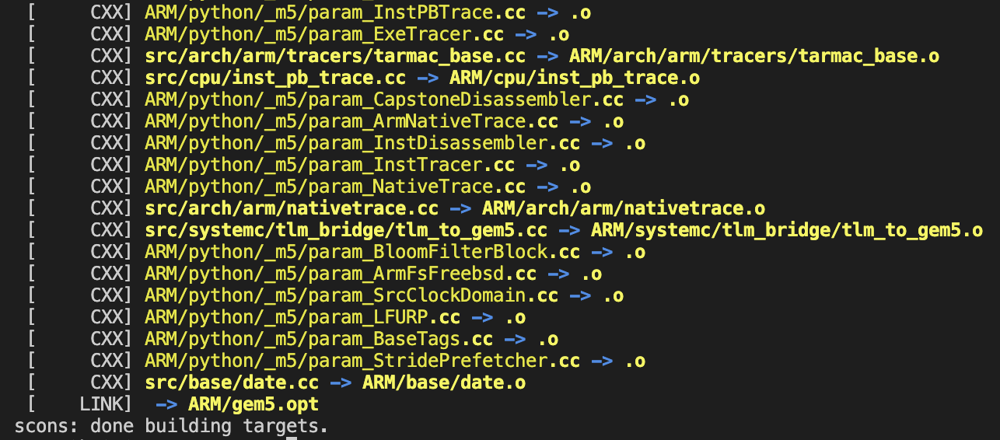
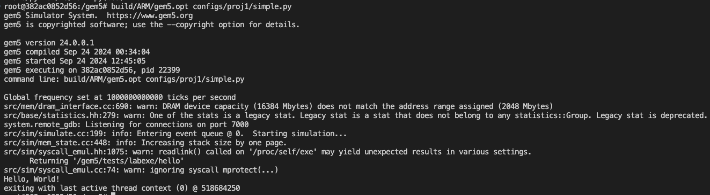
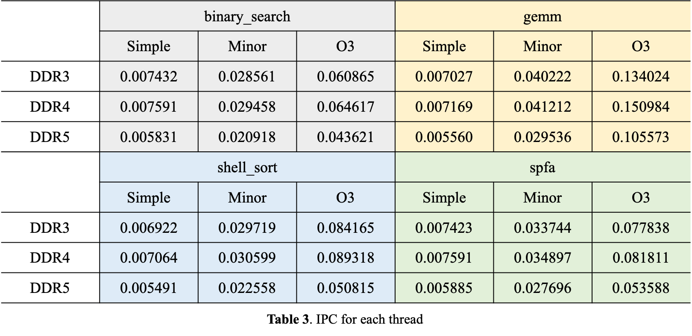
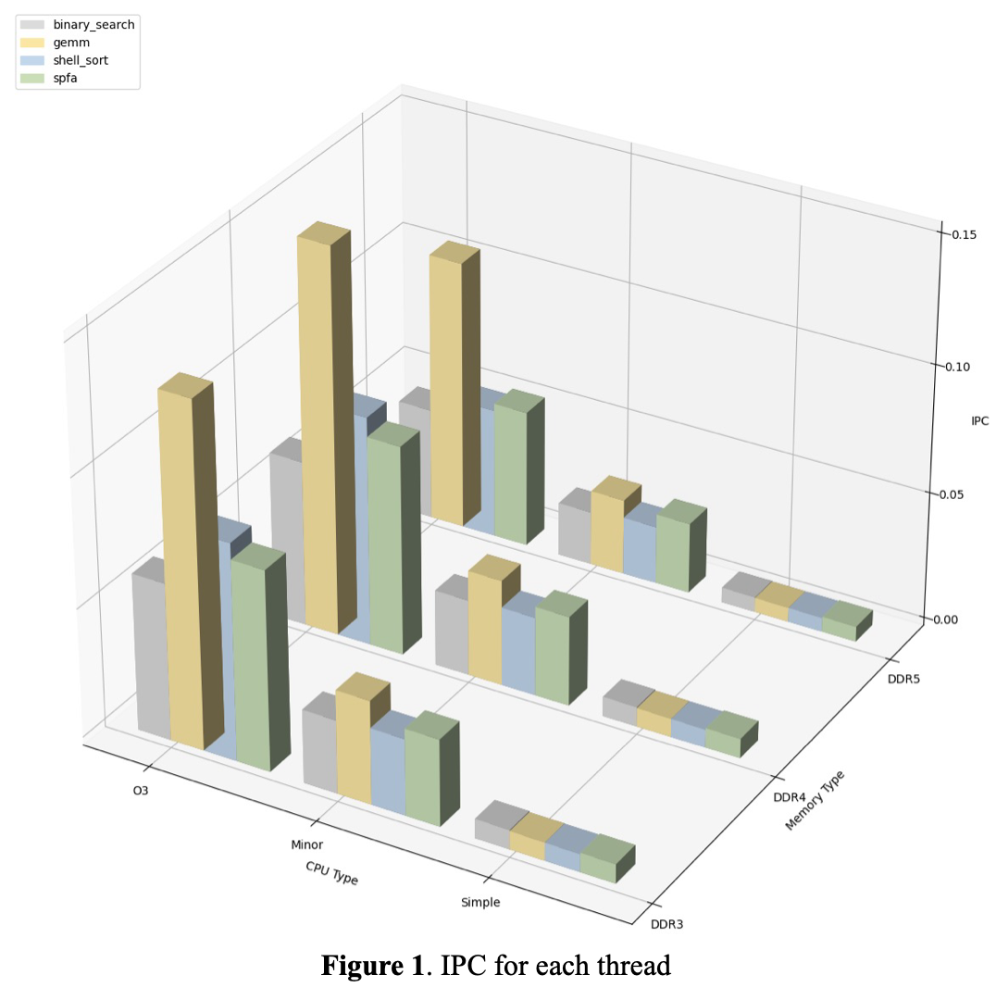

# Project 1 Report
2100012289, Peiyu Liu, School of EECS
> **Overview**: This project focuses on setting up the required environment for conducting coding experiments. Specifically, we utilize **gem5** to simulate fully functional computer systems with varying performance levels. The first step in this project involves creating a virtual machine using **Docker**, where gem5 will be installed. During the installation process, we clone the gem5 code repository from GitHub and compile it. Afterward, we configure personalized computer systems to run on gem5 and execute specific benchmark programs to measure the performance of different systems.

## Setup: Install Toolchain and Compile gem5
In this part, we complete the configuration of Docker and the installation of gem5. Following the steps provided in the documentation, we pull the Docker image, clone the gem5 repository, and create a Docker container where gem5 is compiled. On a 2021 MacBook Pro with an M1 Pro chip, the compilation takes approximately 3 hours. Due to the lengthy runtime of the benchmark program during the subsequent experiments (part 3) in local environment, the final experiments are conducted on the server provided by the course. The partial output of the successful compilation is shown in the screenshot below.  



## Part 1: Create and Run a Simple Configuration Script
In this section, we create and simulate the execution of a customized computer system on gem5. This step is achieved by creating a configuration file `simple.py` (configs/proj1/simple.py). In `simple.py`, we specify various parameters of the computer system, including those for the CPU, physical memory (DRAM), and parameters related to process initialization. In this section, we designate the test program `hello` (tests/labexe/hello) in `simple.py` as the program to be loaded and executed. After completing these steps, the simulation is started with the following command, and the screenshot of the output is shown in the image below.
```bash
build/ARM/gem5.opt configs/proj1/simple.py
```




We can see from the result that the program has been executed successfully. For this project, warnings can be ignored without error.
## Part 3: Add Options in the Configuration Script 
In this section, we modify `simple.py` to accept parameters passed from the command line. This functionality is primarily implemented using Python's `argparse` library, allowing us to specify system parameters more conveniently without needing to modify the configuration file each time. After making these modifications, we run more complex benchmark programs (e.g., `binary_search`, `shell_sort`, etc.) in addition to `hello`. The system’s performance is measured by calculating **IPC（instructions per cycle）**, with the necessary data found in the output file `stat.txt` during gem5 execution. For convenience, we automate the execution of all benchmark programs via a shell script according to the documentation instructions （noted that in the document, the shell script does **not** designate clock frequency as 2GHz） and save various statistical data. The results are presented and explained below. 

### Parameter Setting
According to the document, we set a fixed clock frequency as 2GHz for all executables and set various types of CPUs and physical memories. All parameters are presented in **Table 1**.


In subsequent experiments, for any specific program, we will run the program with all parameter combinations and calculate the IPC to obtain a relatively accurate metric that can measure CPU performance.

### Instruction Counts
In order to ensure that each benchmark program can complete within a certain time, we set the instruction limit for each thread to 500,000,000 by specifying `system.cpu.max_insts_any_thread` in `simple.py`. After checking the experimental results, we found that all threads reached this limit, and the number of executed instructions was within the range of 500,000,000 - 500,000,003. Therefore, we can assume that the number of executed instructions for all parameter sets and all executed programs is 500,000,000.
### Clock Cycles
The counts of clock cycles are shown in **Table 2**. Generally speaking, the more advanced the CPU, the fewer clock cycles it will consume. In most cases, the number of clock cycles used by the O3CPU is **an order of magnitude** lower than that of the other two CPUs, while the number of clock cycles used by the SimpleCPU is about **4-5 times** that of the MinorCPU. The former is because the O3CPU can more efficiently utilize processor resources, improving the parallel execution capability of instructions. The latter may be due to the fact that the SimpleCPU spends a significant amount of time waiting when accessing memory, whereas the MinorCPU implements pipeline, allowing for higher throughput in executing instructions.
It can also be noted that physical memory has a certain impact on the speed at which the CPU executes instructions. Compared to DDR3, DDR4 can provide a slight improvement in CPU performance. However, DDR5 may actually lead to a decrease in CPU performance under certain conditions.


### Calculation of IPC
The IPCs are shown in **Table 3**. We can calculate IPC with data collected by gem5 during simulation.



**Figure 1** visualizes data in the **Table 3**. As we mentioned above, the combination of DDR4 and O3CPU leads to the best performance in most cases, while using DDR5 or other CPUs will cause noticeable decrease in performance.


### Conclusion
The implementation method of the CPU itself, as well as the "degree of harmony" in its interaction with memory, can significantly impact CPU performance. In certain cases, high-performance memory may not necessarily improve CPU performance. On the contrary, it may even cause a noticeable decline in CPU performance. Additionally, the complexity of the program itself can also affect CPU performance. In this project, compared to other algorithms, the gemm algorithm exhibits the highest IPC in most scenarios, which may be related to the program's memory access patterns, branch logic, and potential parallelism. In summary, the factors influencing CPU performance are quite complex. While improving the CPU's processing capabilities, attention should also be given to the interaction between the CPU and other parts of the computer system (such as physical memory).